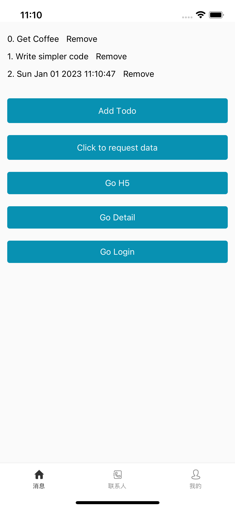
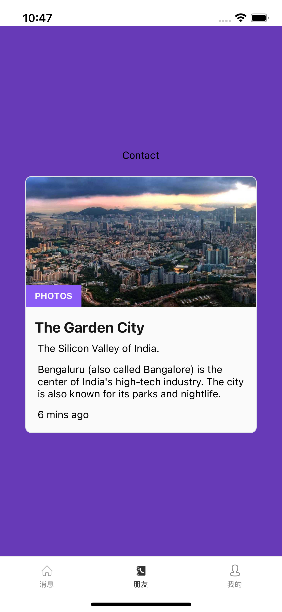

## 1. 研究背景

react native template

## 2. 技术选型

### 2.1 技术选型

| 名称     | 方案                                                                                                                    |
| -------- | ----------------------------------------------------------------------------------------------------------------------- |
| 路由库   | [react navigation](https://reactnavigation.org)                                                                         |
| 状态管理 | mobx + context                                                                                                          |
| SVG 图标 | react-native-svg 搭配 react-native-iconfont-cli                                                                         |
| 本地存储 | @react-native-async-storage/async-storage                                                                               |
| 时间处理 | [dayjs](https://day.js.org/docs/en/installation/typescript)                                                             |
| UI 库    | [native-base](https://docs.nativebase.io/)                                                                              |
| 唯一 ID  | uuid & react-native-get-random-values                                                                                   |
| 消息推送 | [react-native-push-notification](https://github.com/zo0r/react-native-push-notification#readme)                         |
| 日志工具 | [react-native-logs](https://github.com/onubo/react-native-logs)                                                         |
| 动画     | [lottie-react-native](https://github.com/lottie-react-native/lottie-react-native) [lottie](https://airbnb.io/lottie/#/) |
| 文件管理 | [react-native-fs](https://github.com/itinance/react-native-fs) |
| 分包拆包 | TODO                                                                                                                    |

### 2.2 内部架构

```
src
├── App.tsx
├── assets
│   ├── iconfont 图标
│   └── img 图片
├── baseUI 通用UI
├── config 配置
│   ├── index.ts 常量配置
│   ├── theme.ts 主题配置
│   └── request.ts http 请求配置
├── global.d.ts 全局类型定义
├── models 状态管理目录
│   ├── account.ts
│   └── index.ts
├── navigator navigation 配置
│   ├── MainTab.tsx
│   ├── MainTabBar.tsx
│   └── index.tsx
├── pages 页面
│   ├── contact
│   │   └── index.tsx
│   ├── detail
│   │   └── index.tsx
│   ├── h5
│   │   └── index.tsx
│   ├── home
│   │   └── index.tsx
│   ├── login
│   │   ├── index.tsx
│   │   └── style.ts
│   └── me
│       └── index.tsx
├── services 接口
│   └── account.ts
├── types 类型目录
│   ├── ResData.ts
│   └── UserInfo.ts
├── utils 工具函数
│   ├── auth.ts 登录相关
│   ├── screen.ts 页面相关
│   ├── storage.ts 本地存储
└── wrappers
```

### 2.3 启动流程

```tsx
import * as React from 'react';
import {rootStore, StoreContext} from './models';
import Navigator from './navigator';
import {NativeBaseProvider} from 'native-base';
import {loadCacheUInfo} from './utils/auth';
import {View, Text} from 'react-native';

export default function App() {
  const [isLoaded, setIsLoaded] = React.useState(false);

  React.useEffect(() => {
    beforeBootstrap().then(() => {
      setIsLoaded(true);
    });
  }, []);

  // 在应用主框架启动之前要干的事情
  // 可以在这里配置你想干的事情
  const beforeBootstrap = async () => {
    // 从 storage 中取出数据, 加载到内存中
    return await loadCacheUInfo();
  };

  if (!isLoaded) {
    return (
      <View style={{flex: 1, justifyContent: 'center', alignItems: 'center'}}>
        <Text>加载中...</Text>
      </View>
    );
  }

  return (
    <StoreContext.Provider value={rootStore}>
      <NativeBaseProvider>
        <Navigator />
      </NativeBaseProvider>
    </StoreContext.Provider>
  );
}
```

### 2.4 部署流程

## 3. 技术方案

### 3.1 状态管理

mobx + context

### 3.2 SVG 图标处理

参考 https://www.npmjs.com/package/react-native-iconfont-cli

```shell
# 创建 iconfont.json
npx iconfont-init

# 将 SVG 处理为 React Component
npx iconfont-rn
```

## 4. 基础页面

<table>
  <tr>
    <td></td>
    <td></td>
    <td></td>
  </tr>
    <tr>
    <td></td>
    <td></td>
    <td></td>
  </tr>
</table>
